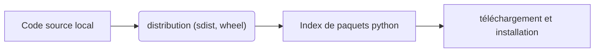

import Giscus from "@site/src/components/Giscus.js";
import TOCInline from "@theme/TOCInline";

:::note Disclaimer

Les informations et conclusions de cet article sont basées sur mes propres analyses et
interprétations, elles ne sont pas entièrement fiables. Je vous invite à vous
référer aux sources originelles et à me faire vos retour en commentaire.

Encore mieux, n'hésitez à proposer directement des
[modifications sur Github](https://github.com/h4c5/blog/edit/main/docs/python/packaging.mdx) 😉

:::

Packager son code, c'est l'emballer dans un joli paquet afin que d'autres personnes puisse le réutiliser 🎁.

Il s'agit d'un concept très important. A chaque fois que vous faites `pip install unpackage` ou `import unpackage`,
vous utilisez des paquets que d'autres ont emballé pour vous.

Alors comment ça marche ? Ne pourrait-on pas se contenter de se partager notre code avec git ? Et bien, c'est plus
complexe qu'il n'y paraît. En fait il y a tout un groupe de travail, la
[Python Packaging Authority](https://github.com/pypa) (alias pypa), qui bosse dessus
[depuis 2011](https://www.pypa.io/en/latest/history/#before-2013).

Dans cette article, on fera un rapide tour d'horizon du packaging en python et on présentera une méthode simple pour
packager son code en 2023.

## Sommaire

<TOCInline toc={toc.filter((node) => node.id !== "sommaire")} />

## Les packages en python

D'abord quelques définition :

### Module python

Un [_module_](https://docs.python.org/fr/3/tutorial/modules.html) python un est fichier texte dont l'extension est `.py`
et qui contient du code python.

On appelle cela _module_ car python permet d'importer les éléments définis dans les fichiers `.py`, ce qui évite de
devoir mettre tout son code dans un seul gros fichier.

Par exemple si l'on crée un fichier `count_lines.py` qui contient une fonction `count_lines_file` il est ensuite
possible d'importer cette fonction :

```python title="count_lines.py"
def count_lines_file(filepath: str) -> int:
    """Count the number of lines in a file"""
    return sum(1 for _ in open(filepath))
```

```python
from count_lines import count_lines_file
count_lines_file("count_lines.py")
3
```

Lorsque l'on execute l'instruction `from count_lines import count_lines_file`, python cherche le module
dans le répertoire courant (là où python a été lancé) ; puis dans le répertoire d'installation de python
`/usr/lib/python3.11` ; puis dans le répertoire où python installe les packages par défaut :
`/usr/lib/python3.11/site-packages`.

Dès que le module est trouvé, il est exécuté dans l'environnement python et les éléments qui y sont définis deviennent
disponibles.

La liste des répertoires dans lequel python cherche les modules est grâce au package `sys` :

```python
import sys
sys.path
["", "/usr/lib/python3.11/python311.zip", "/usr/lib/python3.11/python311", "/usr/lib/python3.11/site-packages"]
```

### Package python

Un [_package_](https://docs.python.org/fr/3/tutorial/modules.html#packages) est un dossier qui regroupe un ensemble de
modules python et qui facilite leur accès en créant un espace de nommage :
`from numpy.linalg import norm`.

Pour créer un package, il suffit de créer un fichier `__init__.py` (qui peut tout a fait être vide) dans un dossier.
Le dossier est alors considéré par python comme un package.

Créons un package pour le module `count_lines.py` :

```
count_package
├── __init__.py
└── count_lines.py
```

A présent on peut utiliser la notation "pointée" pour importer le module `count_lines` :

```python
from count_package.count_lines import count_lines_file
count_lines_file("count_lines.py")
3
```

Lorsque l'on execute l'instruction `from count_package.count_lines import count_lines_file`, python cherche un dossier
`count_package` contenant un fichier `__init__.py` dans les répertoires de `sys.path` (le répertoire courant et les
répertoires par défaut vus plus haut).

Si le package est trouvé, les modules qui y sont présents sont accessibles via la notation "pointée".

## Distribuer son package

Pour distribuer son package on crée une _distribution_. Il s'agit d'une archive contenant le package à distribuer et qui
pourra ensuite être installé avec le gestionnaire de paquet _pip_.

Il en existe deux formats de distributions principaux :

-   Le format [_Source Distribution_](https://packaging.python.org/en/latest/glossary/#term-Source-Distribution-or-sdist)
    (sdist) : il s'agit d'une archive contenant l'ensemble du code source et des métadonnées

-   Le format [_Built Distribution_](https://packaging.python.org/en/latest/glossary/#term-Built-Distribution) :
    il s'agit d'un format de distribution où un certain nombre de choses ont été pré-compilées pour faciliter
    l'installation sur d'autres environnement. C'est notamment utile pour les modules écrits en C / C++.

Le format `wheel` est le format de type _Built Distribution_ de référence. Il s'agit du format développé par la Python
Packaging Authority et qui est très souvent utilisé pour distribuer les packages.

Le workflow de distribution ressemble schématiquement à ça :


```mermaid
flowchart LR
    A[Code source local] --> B("distribution (sdist, wheel)")
    B --> C[Index de paquets python]
    C --> D[téléchargement et installation]
```

Il existe de nombreux outils pour créer des distributions mais aujourd'hui on se focalisera principalement sur les
outils créés par la Python Packaging Authority et qui sont devenus des incontournables, à savoir `setuptools`, `build`
et `twine`.

### setuptools

[`setuptools`](https://setuptools.pypa.io/en/latest/index.html) est l'outil utilisé par la grande majorité des projets
pour construire leurs distributions.

Reprenons notre exemple `count_package` de tout à l'heure et voyons comment créer une distribution avec `setuptools`.

L'arborescence de notre projet pourrait ressembler à ça :

```
projet_genial
├── count_package
│   ├── __init__.py
│   └── count_lines.py
├── tests
│   └── test_count_lines.py
├── .gitignore
├── LICENSE.md
└── README.md
```

Si on ne lui dit pas, `setuptools` n'a aucun moyen de savoir quels sont les fichiers et repertoires qui doivent être
inclus dans notre distribution. Il ne peut pas non plus deviner notre adresse mail, le nom de notre projet, sa version,
etc.

`setuptools` a donc besoin d'un fichier de configuration qui lui permettra de savoir quoi inclure dans la distribution.

Là on ça devient rigolo c'est qu'il y a trois types de fichiers de configuration possible pour setuptools (et ils sont
non mutuellement exclusifs) :

-   Le fichier `setup.py`, le plus ancien et le plus populaire
    ([3.7 millions de résultats sur github](https://github.com/search?q=filename%3Asetup.py))
-   Le fichier `setup.cfg`, le second venu et qui a fait de
    [nombreux et nombreuses adeptes](https://sametmax2.com/vive-setup-cfg-et-mort-a-pyproject-toml/index.html)
    ([0.4 millions de résultats sur github](https://github.com/search?q=filename%3Asetup.py))
-   Le fichier `pyproject.toml`, le dernier venu et qui est à présent le standard officiel pour tous les outils de
    packaging python.
    ([0.2 millions de résultats sur github](https://github.com/search?q=filename%3Asetup.py))

`pyproject.toml` est aujourd'hui le [standard officiel](https://peps.python.org/pep-0621/) mais reste encore très
minoritaire par rapport à `setup.py`, c'est pourquoi nous aborderons les trois formats de fichier.

### setup.py

Le fichier `setup.py` comme son extension le laisse penser est un fichier python. Il a la forme suivante :

```python title="setup.py"
from setuptools import setup

setup(
    name='count_package',
    author='me',
    description='Package for counting the number of lines in files.'
    version='0.0.1',
    python_requires='>=3.7, <4',
    install_requires=[
        'pandas',
        'importlib-metadata; python_version >= "3.8"',
    ],
)
```

Le fait qu'il s'agisse d'un fichier python fait à la fois sa force et sa faiblesse : il est possible de construire la
configuration dynamiquement dans le code mais ça rend la configuration difficile à parser et à interfacer avec d'autres
outils externes.

Puisqu'il s'agit d'un format propre à `setuptools` les distributions de type _sdist_ ne seront installables que si
setuptools a bien été installé sur l'environnement cible et dans une version compatible.

De plus puisque l'immense majorité des projets se sont mis à utiliser setuptools et `setup.py` il est devenu difficile
de proposer des alternatives et des projets comme [flit](https://pypi.org/project/flit/) on dû être construit "par
dessus" `setuptools`, ce qui ne favorise pas l'innovation.

Par ailleurs son utilisation est souvent problématique. Pour reprendre l'exemple de
[cet article](https://bernat.tech/posts/pep-517-518/#packaging-tool-diversity), vous pourriez par exemple être tenté de
d'introduire une condition _if/else_ dans votre `setup.py` pour gérer une dépendance nécessaire en python 2.7 en vous
basant sur `sys.version` mais ce faisant vous introduiriez un bug vicieux : la dépendance sera embarquée ou non en
fonction de l'environnement qui compile la distribution de votre package et non pas en fonction de l'environnement de
l'utilisateur qui l'installe.

Il est aussi tentant
[d'importer le package depuis `setup.py`](https://bernat.tech/posts/growing-pain/#importing-the-built-package-from-within-setuppy)
pour gérer la version sa version par exemple. Ce qui fera planter les distributions sdist.

Aujourd'hui l'utilisation de `setup.py` est possible mais il est conseillé de privilégier une utilisation déclarative.
De plus l'utilisation du fichier comme script : `python setup.py` est **déprécié** comme l'indique la documentation de
setuptools :

> It is important to remember, however, that running this file as a script (e.g. python setup.py sdist) is strongly
> discouraged, and that the majority of the command line interfaces are (or will be) deprecated (e.g. python setup.py
> install, python setup.py bdist_wininst, …).
>
> We also recommend users to expose as much as possible configuration in a more declarative way via the pyproject.toml
> or setup.cfg, and keep the setup.py minimal with only the dynamic parts (or even omit it completely if applicable).
>
> See [Why you shouldn’t invoke setup.py directly](https://blog.ganssle.io/articles/2021/10/setup-py-deprecated.html)
> for more background.

### setup.cfg

Pour répondre aux problèmes mentionnés ci-dessus et rendre la configuration plus déclarative, la pypa a créé en 2016 le
format de fichier `setup.cfg`.

Le fichier `setup.py` d'exemple plut haut est équivalant au fichier `setup.cfg` suivant :

```cfg title="setup.cfg"
[metadata]
name = count_package
version = 0.0.1
author = me
description = Package for counting the number of lines in files.


[options]
python_requires = >=3.7,<4
install_requires =
    pandas
    importlib-metadata; python_version >= "3.8"
```

Ce format a fait de
[nombreuses et nombreux adeptes](https://sametmax2.com/vive-setup-cfg-et-mort-a-pyproject-toml/index.html) mais a
récemment été supplanté par le format `pyproject.toml` qui est dorénavant le moyen officiel de déclarer la configuration
des packages python.

### pyproject.toml

Le format `pyproject.toml` en plus de reprendre l'approche déclarative de `setup.cfg`, introduit sont lot de nouveauté.
Il est désormais possible (et même obligatoire) de spécifier le builder du package. Il est également un moyen de
centraliser les configuration de nombreux outils de développement de façon agnostique plutôt que de multiplier les
fichiers de configuration du type `tox.ini`, `.coveragerc`, etc.

A propos du builder : comme je le faisais remarquer plus haut, lorsqu'un package est distribué sous format sdist, c'est
le client qui doit construire le package. Lorsqu'il exécute la commande `pip install count_package`, pip doit donc
récupérer la distribution sdit, puis construire le package à partir de la configuration qu'il s'y trouve.
Comment pip fait-il pour savoir quelle configuration utiliser ? Et comment utiliser un autre builder que `setuptools`
à ce moment là ?

Pour répondre à cette problématique, le format `pyproject.toml` inclus une section obligatoire pour définir le builder
qui doit être utilisé pour construire le package :

```toml tile="pyproject.toml"
[build-system]
requires = [
  "setuptools>=44",
  "wheel>=0.30.0",
  "cython>=0.29.4",
]
build-backend = "setuptools.build_meta"
```

Avec `pyproject.toml` il est désormais possible de déclarer à `pip` les dépendances nécessaire au build !

Il est alors tout à fait possible de spécifier l'utilisation d'un autre builder que setuptools, tel que flit :

```toml tile="pyproject.toml"
[build-system]
requires = ["flit"]
build-backend = "flit.api:main"
```

Ce format est en train de s'imposer petit à petit comme le moyen de centraliser la configuration du package. Il est
[le format privilégié par setuptools](https://setuptools.pypa.io/en/latest/userguide/pyproject_config.html) et un
certains nombres d'outils tiers l'utilise pour stocker leur configuration :
[black](https://black.readthedocs.io/en/stable/usage_and_configuration/the_basics.html#what-on-earth-is-a-pyproject-toml-file),
[pytest](https://docs.pytest.org/en/7.2.x/reference/customize.html),
[isort](https://pycqa.github.io/isort/docs/configuration/config_files.html#pyprojecttoml-preferred-format),
etc.

Voici un exemple de fichier `pyproject.toml` pour notre package d'exemple `count_package` :

```toml tile="pyproject.toml"
[build-system]
requires = ["setuptools"]
build-backend = "setuptools.build_meta"

[project]
name = "count_package"
version = "0.0.1"
description = "Package for counting the number of lines in files."
name = "my_package"
authors = [
    {name = "me", email = "email@me.fr"},
]
requires-python = ">=3.8,<4"
dependencies = [
    "pandas",
    'importlib-metadata; python_version >= "3.8"',
]
dynamic = ["version"]
```

La [documentation de setuptools](https://setuptools.pypa.io/en/latest/userguide/pyproject_config.html) donne plus de
détails la configuration au format `pyproject.toml`

### Construire une distribution de son package

Une fois le fichier de configuration (de préférence `pyproject.toml`) écrit, il ne vous reste plus qu'à construire votre
package.

Pour ça, le moyen moderne de procéder et d'utiliser le package [`build`](https://pypi.org/project/build) développé par
la pypa :

```bash
pip install --upgrade build
python -m build
```

`build` commencera par installer le builder spécifié dans votre fichier `pyproject.toml` puis l'utilisera pour
construire une distribution sdist et une wheel.

Vous pourrez ensuite utiliser le package [`twine`](https://twine.readthedocs.io/en/stable/) pour le publier sur le
repository officiel [pypi](https://pypi.org/).

:::info

Pour des raisons de rétro-compatibilité avec les anciennes versions des librairies de packaging,
[vous pouvez créer un fichier `setup.py` minimal](https://setuptools.pypa.io/en/latest/userguide/pyproject_config.html)
en plus du fichier `pyproject.toml` :

```python title="setup.py"
from setuptools import setup

setup()
```

:::

## Le layout

Lors de la configuration de votre package, peut importe la méthode utilisée (`setup.py`, `setup.cfg` ou
`pyproject.toml`), vous devez spécifier les packages **et les sous-packages** que vous souhaitez inclure dans votre
distribution :

```toml title="pyproject.toml"
[tool.setuptools]
packages = ["mypkg", "mypkg.subpkg1", "mypkg.subpkg2"]
```

Heureusement `setuptools` possède une
[fonctionnalité de découverte](https://setuptools.pypa.io/en/latest/userguide/package_discovery.html) automatique de vos
packages et sous-packages. Celle-ci est compatible avec deux layout projets classique :

le layout dit à plat (flat-layout) :

```txt title="flat-layout"
count_package
├── count_package
│   ├── __init__.py
│   └── count_lines.py
├── tests
│   └── test_count_lines.py
├── .gitignore
├── LICENSE.md
└── README.md
```

et le layout avec un dossier src (src-layout) :

```txt title="src-layout"
projet_genial
├── src
|   ├── count_package
│   ├── __init__.py
│   └── count_lines.py
├── tests
│   └── test_count_lines.py
├── .gitignore
├── LICENSE.md
└── README.md
```

La différence peut paraître minime mais personnellement j'ai une grosse préférence pour le src-layout car cela empêche
de prendre des mauvaises habitudes et cela force à comprendre comment le système d'import et d'installation de package
fonctionne en python.

En effet, lorsque vous développez votre package vous tester au fur et à mesure les fonctionnalités que vous ajoutez à
celui-ci.

Pour ce faire, on est très tenté de simplement importer notre package depuis notre fichier de test :

```python title="test_file.py"
from count_package import count_lines
```

Cela fonctionnera si vous utilisez un flat-layout et que vous exécuter votre module de test depuis le répertoire qui
contient le dossier `count_package` car comme on l'a vu plus haut python inclus le répertoire courant dans a liste des
répertoire où il recherche les modules.

Cependant c'est une mauvaise habitude pour deux raisons :

-   D'abord, si vous utilisez setup.py, celui-ci se trouvant à la racine de votre projet, il est en capacité d'importer le
    package `count_package` qu'il est censé installé chez un client en mode sdist ce qui peut provoquer des bugs si on ne
    fait pas attention.
-   Ensuite, **vous ne testez pas vraiment le package tel qu'il sera installé chez les autres** ! En effet, il se peut
    par exemple que vous n'ayez pas pensé à inclure des fichiers de données dans votre fichier de configuration et vos
    tests devraient en conséquence planter. Mais comme ces fichiers sont présents chez vous, vous vous ne apercevez de
    rien.

Pour ces raisons, je pense qu'il est préférable d'opter pour un src-layout et d'utiliser une
[installation editable](https://setuptools.pypa.io/en/latest/userguide/development_mode.html) grâce à la commande :
`pip install -e .` pour le développement local. Cela permet d'installer le package en faisant un lien symbolique avec
votre code afin que les modifications que vous y apportez soient immédiatement répercutées sur le package installé.

Pour une analyse approfondie des avantages du src-layout, je vous renvoie à
[cet article](https://blog.ionelmc.ro/2014/05/25/python-packaging/#the-structure) (qui date de 2014).

## Les Alernatives à setuptools

Il existe aujourd'hui des alternatives solides à setuptools, en voici une liste non exhaustive :

-   [Flit](https://flit.pypa.io/en/stable/) : met l'accent sur la simplicité d'utilisation et de configuration.
-   [Pipenv](https://pipenv.pypa.io/en/latest/) : permet de gérer conjointement l'environnement virtuel de son projet et
    ses dépendances. Ajoute de plus une fonctionnalité très appréciable : la génération de fichiers `Pipfile.lock` qui
    référence des versions exacte des dépendances pour permettre la reproduction à l'identique de l'environnement de
    développement.
    
-   [Poetry](https://python-poetry.org/) : outil très puissant qui permet à la fois de gérer les environnements
    virtuels, les dépendances (et les dépendances des dépendances), de générer un fichier `poetry.lock` similaire à
    `Pipfile.lock`, de publier son package, etc.
    

Je trouve pour ma part que [Poetry](https://python-poetry.org/) est l'outil le plus prometteur au vu de sa capacité à
résoudre les conflits entre les dépendances.

## TL;DR Packager son code python en 2023

Mes conseils pour packager votre code en 2023 :

-   Utilisez le fichier [pyproject.toml](https://setuptools.pypa.io/en/latest/userguide/pyproject_config.html) en
    suivant [le guide setuptools](https://setuptools.pypa.io/en/latest/userguide/quickstart.html).
-   Un petit coup de `pip install build && python -m build` et votre package est prêt à être distribué.
-   Adoptez le src-layout.

En bonus :

-   Essayez [Poetry](https://python-poetry.org/).
-   Utilisez [ce template `cookie-cutter`](https://github.com/h4c5/cookie-python-minimal) tout simple (ou créez le
    votre) pour vos projets.

### Estimons nous heureuses et heureux

Tout ce que je vous ai raconté ici peut sembler beaucoup et pourtant je n'ai fait que survoler le sujet. En tout cas je
pense que l'on peut s'estimer heureuses et heureux lorsque l'on voit ce qu'écrivait le site Sam & Max en 2018 :

> D'abord on a `distutils`, `setuptools`, `distribute`, and `distribute2` qui ont tous été à un moment les "standards"
> recommandés pour packager une lib. Ensuite on a eu l'époque des `eggs`, `exe`, et autres trucs que `easy_install`
> allait chercher n'importe où dans la nature en suivant aveuglément des liens sur PyPi. Sans compter les machins qu'il
> fallait compiler à tout bout de champ. Et puis rien n'était chiffré au download, `pip` n'était pas packagé avec
> Python, il crevait sur des erreurs stupides type encodage mal géré...
>
> À ça se rajoute que `virtualenv` était un truc à part, avec plein de concurrents, et linkait les packages système par
> défaut. Sans oublier qu'on avait pas `python -m`.
>
> Bref, le packaging Python, ça a été vraiment la merde. Avec en plus une doc de merde.

C'est quand même beaucoup plus simple aujourd'hui.

## Références

1.  Le Guide de pypa sur le packaging python :
    [An Overview of Packaging for Python](https://packaging.python.org/en/latest/overview/)
2.  Un article pour comprendre les wheels :
    [What Are Python Wheels and Why Should You Care?](https://realpython.com/python-wheels/#python-packaging-made-better-an-intro-to-python-wheels)
3.  Une série de trois articles très éclairant sur le fonctionnement du packaging python, écrit par Bernát Gábor en
    2019 :
    -   [The state of Python Packaging](https://bernat.tech/posts/pep-517-and-python-packaging/)
    -   [Python Packaging - Past, Present, Future](https://bernat.tech/posts/pep-517-518/)
    -   [Python packaging - Growing Pains](https://bernat.tech/posts/growing-pain/)
4.  Un article à la gloire de `setup.cfg` sur le regretté site Sam & Max :
    [à propos de setup.cfg](https://sametmax2.com/vive-setup-cfg-et-mort-a-pyproject-toml/index.html)
5.  Question stackoverflow :
    [What is pyproject.toml file for](https://stackoverflow.com/questions/62983756/what-is-pyproject-toml-file-for)

<Giscus />
